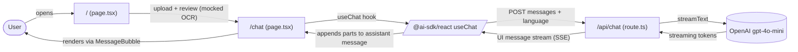
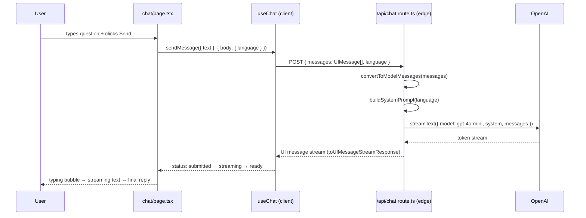

# spr26-Team-10 — formly.ai

Eva Tom | Ruba Ahmed | Eric He | Tyler Huang | Stephen Makuol


**formly.ai** is a friendly assistant that helps
people understand U.S. government forms in their preferred language.

The current prototype lets a user pick a language, ask questions in a chat
panel, and get a streaming AI reply grounded in a (currently mocked) form. The
MVP is built on Next.js 16 + React 19 + the Vercel AI SDK v6 with OpenAI as the
model provider.

**Team:** Eva Tom, Ruba Ahmed, Eric He, Tyler Huang, Stephen Makuol

---

## Repository layout

```
spr26-Team-10/
├── README.md                          ← you are here
├── ruba-test.py / stephen_test.py     ← legacy stubs, ignore
└── my-app/                            ← the Next.js app (everything lives here)
    ├── README.md                      ← Next-specific setup notes
    ├── AGENTS.md                      ← guidance for AI coding agents
    ├── CLAUDE.md                      ← imports AGENTS.md
    ├── package.json                   ← deps: next 16, react 19, ai v6,
    │                                    @ai-sdk/openai, @ai-sdk/react,
    │                                    @supabase/supabase-js
    ├── next.config.ts / tsconfig.json / eslint.config.mjs / postcss.config.mjs
    ├── .env.local.example             ← template; copy to .env.local
    ├── .gitignore                     ← ignores .env* except the example
    ├── app/                           ← Next.js App Router
    │   ├── layout.tsx                 ← root <html>/<body>, DM Sans font
    │   ├── globals.css                ← Tailwind v4 + theme tokens
    │   ├── page.tsx                   ← landing / upload / OCR-review steps
    │   ├── api/
    │   │   └── chat/
    │   │       └── route.ts           ← edge POST /api/chat → OpenAI stream
    │   └── chat/
    │       ├── page.tsx               ← /chat — three-pane chat shell
    │       ├── ChatInput.tsx          ← bottom input bar (loading-aware)
    │       ├── MessageBubble.tsx      ← AI/user bubble, suggestions,
    │       │                            annotations, citation chip
    │       ├── LanguageDropdown.tsx   ← en / es / zh / ar / fr selector
    │       └── messages.ts            ← seed UIMessage[] + messageMeta map
    ├── lib/
    │   └── supabaseClient.ts          ← currently empty (see TODO below)
    └── public/
        ├── formly_nobackground.png    ← brand logo
        └── file.svg / globe.svg / next.svg / vercel.svg / window.svg
```

---

## Data flow / architecture

### High-level flow



### Chat request lifecycle



### Component responsibilities

| File                              | Responsibility                                                                                              |
| --------------------------------- | ----------------------------------------------------------------------------------------------------------- |
| `app/page.tsx`                    | Landing page. Two-step upload → OCR-review wizard. (OCR text is currently hardcoded.)                       |
| `app/chat/page.tsx`               | Chat shell. Owns the `useChat` hook, language state, layout, typing bubble, and error-with-Retry chip.      |
| `app/chat/ChatInput.tsx`          | Bottom input bar. Disables itself + swaps placeholder/label while `isLoading`. Enter-to-send.               |
| `app/chat/MessageBubble.tsx`      | Renders one `UIMessage`. Joins text parts; looks up suggestions / annotations / citation in `messageMeta`.  |
| `app/chat/LanguageDropdown.tsx`   | Pill-style selector for `en` / `es` / `zh` / `ar` / `fr`. Triggers `dir="rtl"` for Arabic.                  |
| `app/chat/messages.ts`            | Exports `seedMessages: UIMessage[]` (for demo polish) and `messageMeta` keyed by id (chips / annotations).  |
| `app/api/chat/route.ts`           | Edge runtime POST. Builds system prompt with target language, streams `gpt-4o-mini` via the AI SDK.         |
| `lib/supabaseClient.ts`           | **Empty.** Will hold the Supabase client when the document-grounding workstream lands.                      |

### Language handling

The dropdown's selected language code is sent **per request** as a `body` field
on `sendMessage`. The route handler maps it to a human-readable name and bakes
it into the system prompt (e.g. *"Reply in Spanish, regardless of the language
of the user's question"*). This means switching the dropdown takes effect on
the next message without re-creating the `useChat` hook.

The chat **chrome** (sidebar headings, subtitle, etc.) is independently
re-labeled in `app/chat/page.tsx` from a static `uiLabels` map.

### Out of scope (TODO)

- **Supabase / document grounding** — `lib/supabaseClient.ts` is empty, the
  OCR-review step on the home page uses hardcoded I-765 text, and the route
  handler does not pull document context from a database. A separate
  workstream owns this; it will plug into the system prompt (or a tool call)
  once the schema and OCR pipeline land.
- **Conversation persistence** — refreshing `/chat` resets to the seed thread.
- **Auth** — none yet; chat is fully anonymous.
- **AI-generated suggestion chips / annotations / citations** — the live model
  returns plain text. The rich UI elements only render for the seed messages
  via `messageMeta`. Generating them from real form context will need a
  structured-output pass once document grounding exists.

---

## Runbook

### Prerequisites

- Node.js 18+ (the AI SDK requires it; Next.js 16 wants 18.18+).
- npm 10+ (or another package manager — examples below assume npm).
- An OpenAI API key with access to `gpt-4o-mini`. Get one at
  [platform.openai.com/api-keys](https://platform.openai.com/api-keys).

### First-time setup

```bash
git clone git@github.com:StanfordCS194/spr26-Team-10.git
cd spr26-Team-10/my-app

# install deps (will pull next 16, react 19, ai v6, etc.)
npm install

# create your local env file from the template
cp .env.local.example .env.local
# then edit .env.local and set:
#   OPENAI_API_KEY=sk-...
```

> `.env.local` is gitignored. `.env.local.example` is committed.

### Local development

```bash
cd my-app
npm run dev
```

Then open http://localhost:3000.

- `/` — upload + OCR-review wizard. Pick any file, click "Upload and continue",
  then "Confirm and ask questions" to land on `/chat`.
- `/chat` — type a question and watch the reply stream. Switch the language
  dropdown and ask another question to see the response come back in the new
  language.

### Common scripts

```bash
cd my-app

npm run dev         # start the dev server (Turbopack)
npm run build       # production build; also runs the TS checker
npm run start       # serve the production build
npm run lint        # ESLint (eslint.config.mjs)
npx tsc --noEmit    # type-check without emitting
```

### Deployment

The app is a stock Next.js 16 project, so any Next-compatible host works
(Vercel is the easiest path). The only required server-side env var is
`OPENAI_API_KEY`. Once Supabase lands, expect to add `NEXT_PUBLIC_SUPABASE_URL`
and `NEXT_PUBLIC_SUPABASE_ANON_KEY` (and possibly a service-role key for the
route handler).

### Troubleshooting

| Symptom                                        | Likely cause / fix                                                                                |
| ---------------------------------------------- | ------------------------------------------------------------------------------------------------- |
| Error chip + Retry on every send               | `OPENAI_API_KEY` missing / invalid in `my-app/.env.local`. Restart `npm run dev` after editing.   |
| `Module not found: ai` / `@ai-sdk/openai`      | Run `npm install` inside `my-app/` — the lockfile pins AI SDK v6.                                 |
| TS errors mentioning `Message` / old shape     | A consumer is still on the pre-v6 message shape. Use `UIMessage` from `ai` and read `parts`.      |
| Reply comes back in the wrong language         | Make sure you sent a new message **after** changing the dropdown — language is per-request.       |
| `/chat` typing bubble never goes away          | Check the browser network tab — the SSE stream from `/api/chat` may be blocked by an extension.   |

### AI agent guidance

If you're using Cursor, Claude Code, or another coding agent, also read
[`my-app/AGENTS.md`](my-app/AGENTS.md). Next.js 16 has breaking changes from
older versions, and the file points agents at `node_modules/next/dist/docs/`
for current API references.
