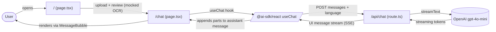
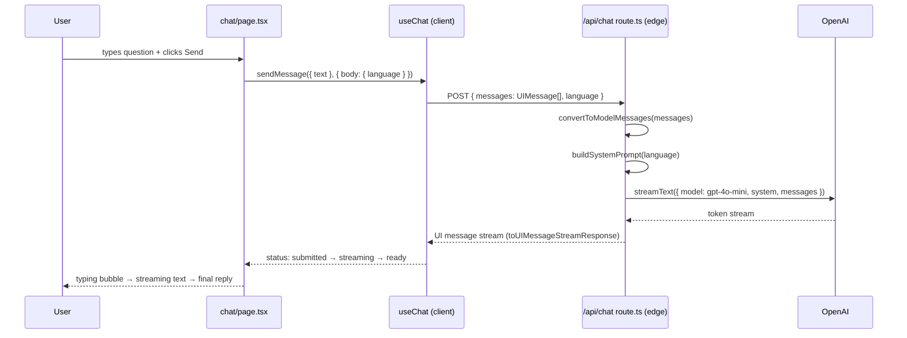
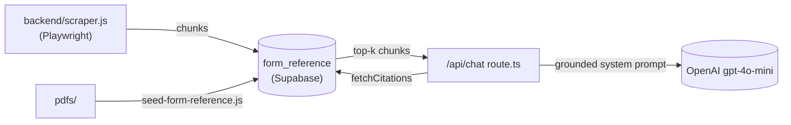

# spr26-Team-10 — formly.ai

Eva Tom | Ruba Ahmed | Eric He | Tyler Huang | Stephen Makuol


**formly.ai** is a friendly assistant that helps
people understand U.S. government forms in their preferred language.

The current prototype lets a user pick a language, ask questions in a chat
panel, and get a streaming AI reply grounded in a (currently mocked) form. The
MVP is built on Next.js 16 + React 19 + the Vercel AI SDK v6 with OpenAI as the
model provider.

**Team:** Eva Tom, Ruba Ahmed, Eric He, Tyler Huang, Stephen Makuol

---

## Repository layout

```
spr26-Team-10/
├── README.md                          ← you are here
├── ruba-test.py / stephen_test.py     ← legacy stubs, ignore
├── backend/
│   ├── scraper.js                     ← Playwright crawler → form_reference table
│   └── seed-form-reference.js         ← one-shot seed script for bundled PDFs
├── pdfs/                              ← bundled government form PDFs (i-765, cms-40b, w-4v, ss-4 …)
├── sql/
│   ├── 05_form_reference.sql          ← form_reference schema (content, form_key, embedding)
│   └── 07_form_reference_source_metadata.sql
└── my-app/                            ← the Next.js app (everything lives here)
    ├── README.md                      ← Next-specific setup notes
    ├── AGENTS.md                      ← guidance for AI coding agents
    ├── CLAUDE.md                      ← imports AGENTS.md
    ├── package.json                   ← deps: next 16, react 19, ai v6,
    │                                    @ai-sdk/openai, @ai-sdk/react,
    │                                    @supabase/supabase-js
    ├── next.config.ts / tsconfig.json / eslint.config.mjs / postcss.config.mjs
    ├── .env.local.example             ← template; copy to .env.local
    ├── .gitignore                     ← ignores .env* except the example
    ├── app/                           ← Next.js App Router
    │   ├── layout.tsx                 ← root <html>/<body>, DM Sans font
    │   ├── globals.css                ← Tailwind v4 + theme tokens
    │   ├── page.tsx                   ← landing / upload / OCR-review steps
    │   ├── api/
    │   │   └── chat/
    │   │       └── route.ts           ← edge POST /api/chat → OpenAI stream
    │   ├── citations/
    │   │   ├── route.ts               ← GET /citations — top-k form_reference rows
    │   │   └── [id]/page.tsx          ← citation detail page
    │   ├── chat/
    │   │   ├── page.tsx               ← /chat — three-pane chat shell
    │   │   ├── ChatInput.tsx          ← bottom input bar (loading-aware)
    │   │   ├── MessageBubble.tsx      ← AI/user bubble, suggestions,
    │   │   │                            annotations, citation chip
    │   │   ├── LanguageDropdown.tsx   ← en / es / zh / ar / fr selector
    │   │   └── messages.ts            ← seed UIMessage[] + messageMeta map
    │   └── step/
    │       └── 2/
    │           └── ReviewStep.tsx     ← client component extracted from page.tsx
    ├── components/
    │   └── pdf-viewer/
    │       ├── PdfViewer.tsx          ← canvas PDF viewer, text selection, highlight layer
    │       └── PdfViewer.module.css
    ├── lib/
    │   ├── auth-labels.ts             ← translated login/signup strings (5 languages)
    │   ├── citations.ts               ← CitationSource type + fetchCitations helper
    │   ├── review-labels.ts           ← translated step-2 strings (5 languages)
    │   └── supabaseClient.ts          ← Supabase browser client
    └── public/
        ├── formly_nobackground.png    ← brand logo
        └── file.svg / globe.svg / next.svg / vercel.svg / window.svg
```

---

## Data flow / architecture

### High-level flow


```mermaid
flowchart LR
    User([User]) -->|opens| Home["/ (page.tsx)"]
    Home -->|"upload + review (mocked OCR)"| Chat["/chat (page.tsx)"]
    Chat -->|"useChat hook"| Hook[/"@ai-sdk/react useChat"/]
    Hook -->|"POST messages + language"| Route["/api/chat (route.ts)"]
    Route -->|"streamText"| OpenAI[("OpenAI gpt-4o-mini")]
    OpenAI -->|"streaming tokens"| Route
    Route -->|"UI message stream (SSE)"| Hook
    Hook -->|"appends parts to assistant message"| Chat
    Chat -->|"renders via MessageBubble"| User
```

### Chat request lifecycle


```mermaid
sequenceDiagram
    participant U as User
    participant P as chat/page.tsx
    participant H as useChat (client)
    participant R as /api/chat route.ts (edge)
    participant O as OpenAI

    U->>P: types question + clicks Send
    P->>H: sendMessage({ text }, { body: { language } })
    H->>R: POST { messages: UIMessage[], language }
    R->>R: convertToModelMessages(messages)
    R->>R: buildSystemPrompt(language)
    R->>O: streamText({ model: gpt-4o-mini, system, messages })
    O-->>R: token stream
    R-->>H: UI message stream (toUIMessageStreamResponse)
    H-->>P: status: submitted → streaming → ready
    P-->>U: typing bubble → streaming text → final reply
```

### Component responsibilities

| File                              | Responsibility                                                                                              |
| --------------------------------- | ----------------------------------------------------------------------------------------------------------- |
| `app/page.tsx`                    | Landing page. Two-step upload → OCR-review wizard. (OCR text is currently hardcoded.)                       |
| `app/chat/page.tsx`               | Chat shell. Owns the `useChat` hook, language state, layout, typing bubble, and error-with-Retry chip.      |
| `app/chat/ChatInput.tsx`          | Bottom input bar. Disables itself + swaps placeholder/label while `isLoading`. Enter-to-send.               |
| `app/chat/MessageBubble.tsx`      | Renders one `UIMessage`. Joins text parts; looks up suggestions / annotations / citation in `messageMeta`.  |
| `app/chat/LanguageDropdown.tsx`   | Pill-style selector for `en` / `es` / `zh` / `ar` / `fr`. Triggers `dir="rtl"` for Arabic.                  |
| `app/chat/messages.ts`            | Exports `seedMessages: UIMessage[]` (for demo polish) and `messageMeta` keyed by id (chips / annotations).  |
| `app/api/chat/route.ts`           | Edge runtime POST. Resolves `form_key`, fetches relevant `form_reference` chunks via `lib/citations.ts`, builds a grounded system prompt, and streams `gpt-4o-mini` via the AI SDK. |
| `lib/citations.ts`                | `CitationSource` / `FormReferenceRow` types and `fetchCitations(query, formKey)` — queries `form_reference` for relevant chunks. |
| `lib/auth-labels.ts`              | Translation map (en/es/zh/ar/fr) for all login and sign-up UI strings. |
| `lib/review-labels.ts`            | Translation map (en/es/zh/ar/fr) for step-2 review UI strings. |
| `lib/supabaseClient.ts`           | Supabase browser client.                                                                                    |
| `components/pdf-viewer/PdfViewer.tsx` | Canvas PDF viewer (`pdfjs-dist`). Renders at `zoom × dpr`. Transparent text layer enables selection; selecting text shows a floating "Ask about this" button that stores a zoom-normalised highlight rect. Zoom controls auto-fit on load and on panel resize. `direction: ltr` forced on root to prevent RTL inheritance corrupting canvas coordinates. |
| `app/citations/route.ts`          | `GET /citations?q=` — returns top-k `form_reference` rows; consumed by `/api/chat` for RAG.                |
| `app/citations/[id]/page.tsx`     | Citation detail page linked from `MessageBubble` chips.                                                     |
| `app/step/2/ReviewStep.tsx`       | Client component (split from `page.tsx`). Owns field review, inline editing (flag → textarea → save/cancel), and "Confirm all" batch button. |
| `backend/scraper.js`              | Node.js/Playwright crawler. Visits gov-form pages and sub-links; web pages are chunked (~500 words, 50-word overlap) and upserted into `form_reference`. PDFs are downloaded to `pdfs/` and parsed page-by-page. A junk-pattern filter skips non-guidance documents. |
| `backend/seed-form-reference.js`  | One-shot seed; inserts bundled `pdfs/` into `form_reference` without running the full crawler. Useful for fresh Supabase instances. |

### Document grounding & RAG pipeline


```mermaid
flowchart LR
    Scraper["backend/scraper.js\n(Playwright)"] -->|chunks| DB[("form_reference\n(Supabase)")]
    PDF["pdfs/"] -->|seed-form-reference.js| DB
    Route["/api/chat route.ts"] -->|fetchCitations| DB
    DB -->|top-k chunks| Route
    Route -->|grounded system prompt| OpenAI[("OpenAI gpt-4o-mini")]
```

At upload time the document's `form_key` (e.g. `i-765`) is resolved from the
file name. On each chat turn `/api/chat` calls `fetchCitations(userMessage,
formKey)` to retrieve the most relevant `form_reference` chunks and injects them
into the system prompt before streaming to OpenAI. Citation metadata is returned
alongside the stream and rendered as chips in `MessageBubble`.

### Language handling

The dropdown's selected language code is sent **per request** as a `body` field
on `sendMessage`. The route handler maps it to a human-readable name and bakes
it into the system prompt (e.g. *"Reply in Spanish, regardless of the language
of the user's question"*). This means switching the dropdown takes effect on
the next message without re-creating the `useChat` hook.

The chat **chrome** (sidebar headings, subtitle, etc.) is independently
re-labeled in `app/chat/page.tsx` from a static `uiLabels` map.

Login, sign-up, and step-2 review pages follow the same pattern via
`lib/auth-labels.ts` and `lib/review-labels.ts`.

Arabic-specific fixes: the chat panel CSS keeps AI bubbles left-aligned and
user bubbles right-aligned under `dir="rtl"`. The PDF viewer forces
`direction: ltr` on its root element so canvas coordinate calculations are
unaffected by RTL inheritance.

### Out of scope (TODO)

- **Supabase / document grounding** — **Done.** `backend/scraper.js` populates
  `form_reference`; `/api/chat` retrieves relevant chunks via `lib/citations.ts`
  and injects them into the system prompt.
- **Conversation persistence** — refreshing `/chat` resets to the seed thread.
- **Auth** — **Done.** Supabase Auth for sign-up/login; guest mode available via
  "Continue as guest" on the login page.
- **Citations** — **Done.** `form_reference` chunks are retrieved per query and
  rendered as citation chips in `MessageBubble`; each links to `/citations/[id]`.

---

## Runbook

### Prerequisites

- Node.js 18+ (the AI SDK requires it; Next.js 16 wants 18.18+).
- npm 10+ (or another package manager — examples below assume npm).
- An OpenAI API key with access to `gpt-4o-mini`. Get one at
  [platform.openai.com/api-keys](https://platform.openai.com/api-keys).

### First-time setup

```bash
git clone git@github.com:StanfordCS194/spr26-Team-10.git
cd spr26-Team-10/my-app

# install deps (will pull next 16, react 19, ai v6, etc.)
npm install

# create your local env file from the template
cp .env.local.example .env.local
# then edit .env.local and set:
#   OPENAI_API_KEY=sk-...
```

> `.env.local` is gitignored. `.env.local.example` is committed.

### Local development

```bash
cd my-app
npm run dev
```

Then open http://localhost:3000.

- `/` — upload + OCR-review wizard. Pick any file, click "Upload and continue",
  then "Confirm and ask questions" to land on `/chat`.
- `/chat` — type a question and watch the reply stream. Switch the language
  dropdown and ask another question to see the response come back in the new
  language.

### Common scripts

```bash
cd my-app

npm run dev         # start the dev server (Turbopack)
npm run build       # production build; also runs the TS checker
npm run start       # serve the production build
npm run lint        # ESLint (eslint.config.mjs)
npx tsc --noEmit    # type-check without emitting

# Populate form_reference (run from repo root, once or after adding new PDFs)
node backend/scraper.js                   # crawl ssa.gov/prepare (default)
node backend/scraper.js <url>             # crawl a different gov page
node backend/seed-form-reference.js       # seed from bundled pdfs/ only
```

### Deployment

The app is a stock Next.js 16 project, so any Next-compatible host works
(Vercel is the easiest path). Required env vars:

| Variable | Used by |
| -------- | ------- |
| `OPENAI_API_KEY` | `/api/chat` — model inference |
| `NEXT_PUBLIC_SUPABASE_URL` | Supabase client (browser + server) |
| `NEXT_PUBLIC_SUPABASE_ANON_KEY` | Supabase browser client, scraper fallback |
| `SUPABASE_SERVICE_ROLE_KEY` | Server-side Supabase calls, scraper |

### Troubleshooting

| Symptom                                        | Likely cause / fix                                                                                |
| ---------------------------------------------- | ------------------------------------------------------------------------------------------------- |
| Error chip + Retry on every send               | `OPENAI_API_KEY` missing / invalid in `my-app/.env.local`. Restart `npm run dev` after editing.   |
| `Module not found: ai` / `@ai-sdk/openai`      | Run `npm install` inside `my-app/` — the lockfile pins AI SDK v6.                                 |
| TS errors mentioning `Message` / old shape     | A consumer is still on the pre-v6 message shape. Use `UIMessage` from `ai` and read `parts`.      |
| Reply comes back in the wrong language         | Make sure you sent a new message **after** changing the dropdown — language is per-request.       |
| `/chat` typing bubble never goes away          | Check the browser network tab — the SSE stream from `/api/chat` may be blocked by an extension.   |

### AI agent guidance

If you're using Cursor, Claude Code, or another coding agent, also read
[`my-app/AGENTS.md`](my-app/AGENTS.md). Next.js 16 has breaking changes from
older versions, and the file points agents at `node_modules/next/dist/docs/`
for current API references.
